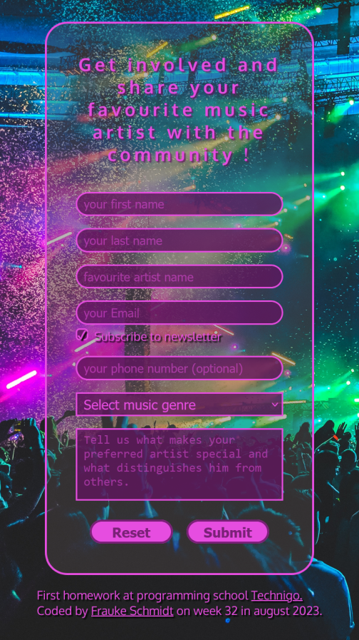

# Technigo web development bootcamp august 2023 - jan 2024: homework 1

This is a solution to the first homework for the students:

**What you need to do**

In this exercise, you will create a fun and interactive HTML form to collect information about people's favorite
        musical artists.

    
This exercise will help you practice creating various form elements and understand how to gather user input.

    
This form should contain the following:

    <ul>
        <li>Name field</li>
        <li>Email field</li>
        <li>Phone field</li>
        <li>A dropdown field to ask for favorite genre</li>
        <li>A text area field to ask the user to explain why they like this genre so much</li>
        <li>A button to submit the form</li>
        <li>A button to reset the form</li>
    </ul>
    
Important: Remember to add labels for each of the inputs asked for

## Table of contents

  - [Overview](#overview)
  - [Screenshot](#screenshot)
  - [Links](#links)
  - [My process](#my-process)
  - [Built with](#built-with)
  - [What I learned](#what-i-learned)
  - [Continued development](#continued-development)
  - [Useful resources](#useful-resources)
  - [Author](#author)

## Overview

1st homework for front end developer students.

### Screenshot

 and 

### Links

- Solution URL: [https://github.com/colognia/First-homework-at-programming-bootcamp-Technigo---form]
- Live Site URL: [https://colognia.github.io/First-homework-at-programming-bootcamp-Technigo---form/]

## My process
- check out examples for forms, collecting screenshots, going for transparent form
- making a feature plan: what form should do and how both views should look like. I sketched the basic structure of my nested containers. Working with li items like suggested made no sense for me, so used divs.
- finding appropriate background image 
- making a sketch with figma (4 hours)
- build html top to bottom, mobile first
- create css
- write a little javascript for first time
- check and verify frequently with firefox and its developer console
- consulting my own notes regarding usage of tags/options, consulting developers.mozilla.org and w3schools, checking stackoverflow

### Built with

- Semantic HTML5 markup
- CSS custom properties
- vanilla JS
- editor: visual studio code

### What I learned

Had to deal with figma which is new to me, took me a lot time to get kind of used to it.
Used a little bit of JS first time and had problems with it, but finally got a hint from a classmate and later as well from freecodecamp forum to explain why it was not working.

### Continued development

Want to use more JS slowly but surely. Want to get faster.

### Useful resources

w3schools, dev.mozilla.org, stackoverflow, my bootcamp Technigo, Videos of Kevin Powell (css god)

## Author

- Linkedin - (https://www.linkedin.com/in/frauke-s-395242201/)

